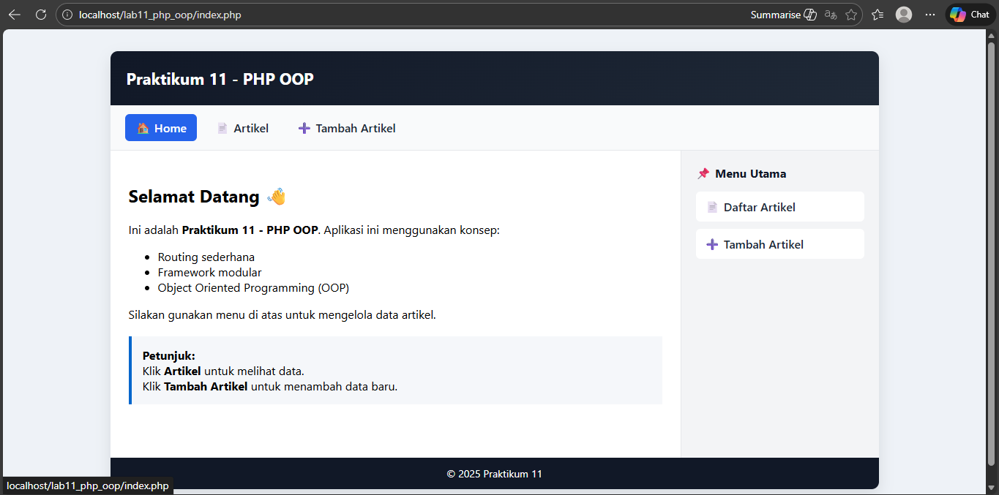
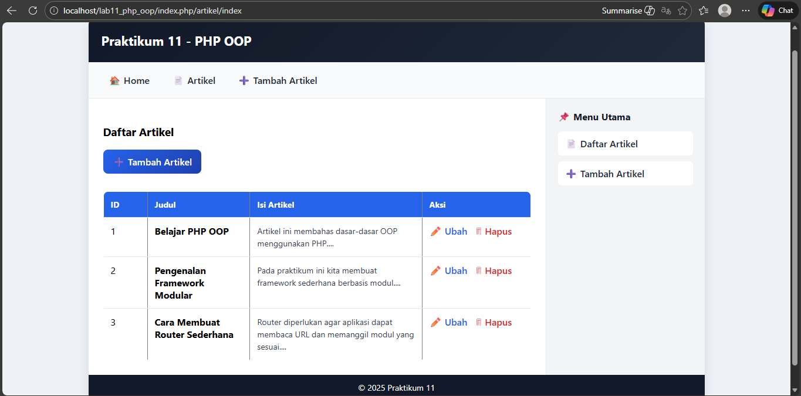
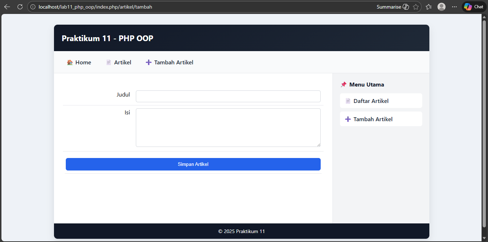
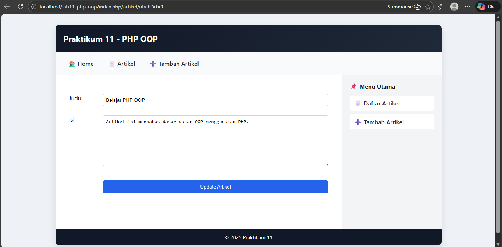
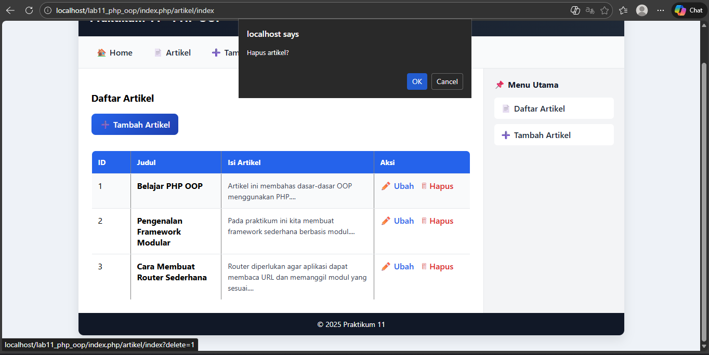

# Praktikum 11: PHP OOP Lanjutan - Framework Modular

**Nama:** Sayyid Sulthan Abyan

**NIM:** 312410496

**Kelas:** TI 24 A5

## Tujuan Praktikum
1. Memahami konsep dasar Framework Modular
2. Memahami konsep dasar routing
3. Membuat Framework sederhana menggunakan PHP OOP

## Struktur Folder Project

```
lab11_php_oop/
├── .htaccess
├── config.php
├── index.php
├── class/
│   ├── Database.php
│   └── Form.php
├── module/
│   ├── home/
│   │   └── index.php
│   └── artikel/
│       ├── index.php
│       ├── tambah.php
│       └── ubah.php
└── template/
    ├── header.php
    └── footer.php
```

## Langkah-langkah Praktikum

### 1. Persiapan Database

Buat database dan tabel menggunakan query SQL berikut:

```sql
CREATE DATABASE IF NOT EXISTS latihan_oop;
USE latihan_oop;

CREATE TABLE IF NOT EXISTS artikel (
    id INT AUTO_INCREMENT PRIMARY KEY,
    judul VARCHAR(255) NOT NULL,
    isi TEXT NOT NULL,
    created_at TIMESTAMP DEFAULT CURRENT_TIMESTAMP
);
```


### 2. Konfigurasi Database (config.php)

File ini berisi konfigurasi koneksi database.

```php
<?php
$config = [
    'host' => 'localhost',
    'username' => 'root',
    'password' => '',
    'db_name' => 'latihan_oop'
];
?>
```

### 3. Class Database (class/Database.php)

Class ini menangani operasi database (CRUD - Create, Read, Update, Delete).

**Fitur:**
- `query()` - Menjalankan query SQL
- `get()` - Mengambil satu data
- `insert()` - Menambah data
- `update()` - Mengubah data
- `delete()` - Menghapus data


### 4. Class Form (class/Form.php)

Class ini untuk membuat form input dinamis dengan berbagai tipe input.

**Tipe Input yang Didukung:**
- Text

### 5. File .htaccess

File ini mengatur URL rewriting agar routing dapat berfungsi.

```apache
<IfModule mod_rewrite.c>
    RewriteEngine On
    RewriteBase /lab11_php_oop/
    RewriteCond %{REQUEST_FILENAME} !-d
    RewriteCond %{REQUEST_FILENAME} !-f
    RewriteRule ^(.*)$ index.php/$1 [L]
</IfModule>
```


### 6. Routing System (index.php)

File ini adalah gerbang utama yang menangani routing ke modul-modul.

**Cara Kerja Routing:**
- URL: `http://localhost/lab11_php_oop/artikel/index`
- Module: `artikel`
- Page: `index`
- File: `module/artikel/index.php`


### 7. Template System

#### template/header.php
Berisi header HTML, CSS, dan navigasi.


#### template/footer.php
Berisi penutup HTML dan footer.


### 8. Module Home

#### module/home/index.php
Halaman utama/beranda aplikasi.


### 9. Module Artikel

#### module/artikel/index.php
Menampilkan daftar artikel dari database.

**Fitur:**
- Menampilkan semua artikel dalam tabel
- Tombol tambah artikel
- Tombol edit dan hapus per artikel


#### module/artikel/tambah.php
Form untuk menambah artikel baru.


#### module/artikel/ubah.php
Form untuk mengubah artikel yang sudah ada.


## Konsep yang Dipelajari

### 1. Framework Modular
Framework modular adalah arsitektur aplikasi di mana setiap fitur dipisahkan ke dalam modul-modul independen. Keuntungannya:
- Kode lebih terorganisir
- Mudah dikembangkan (scalable)
- Mudah dipelihara (maintainable)
- Dapat digunakan kembali (reusable)

### 2. Routing
Routing adalah mekanisme untuk mengarahkan URL ke controller/file yang sesuai.

**Contoh:**
```
URL: /lab11_php_oop/artikel/tambah
├── Module: artikel
└── Page: tambah
    └── File: module/artikel/tambah.php
```

### 3. URL Rewriting
Menggunakan `.htaccess` untuk membuat URL yang lebih bersih dan SEO-friendly.

**Sebelum:** `index.php?mod=artikel&page=tambah`  
**Sesudah:** `/artikel/tambah`

### 4. Template System
Memisahkan bagian layout (header, footer) dari konten untuk menghindari duplikasi kode.

## Hasil Output

### 1. Halaman Home


### 2. Halaman Daftar Artikel


### 3. Halaman Tambah Artikel


### 4. Halaman Edit


### 5. Halaman Hapus


## Cara Menjalankan Project

1. Pastikan XAMPP sudah terinstall dan Apache + MySQL aktif
2. Copy folder `lab11_php_oop` ke `C:\xampp\htdocs\`
3. Import database menggunakan file `database.sql`
4. Sesuaikan konfigurasi di `config.php`
5. Buka browser dan akses: `http://localhost/lab11_php_oop/`

## Testing

### Test Routing
- ✓ Home: `http://localhost/lab11_php_oop/home/index`
- ✓ Artikel: `http://localhost/lab11_php_oop/artikel/index`
- ✓ Tambah: `http://localhost/lab11_php_oop/artikel/tambah`

### Test CRUD Operations
- ✓ Create: Tambah artikel baru
- ✓ Read: Tampilkan daftar artikel
- ✓ Update: Edit artikel
- ✓ Delete: Hapus artikel

## Kesimpulan

Dari praktikum ini, saya telah mempelajari:
1. Cara membuat framework modular sederhana menggunakan PHP OOP
2. Implementasi routing untuk membuat URL yang lebih bersih
3. Penggunaan class Database untuk operasi CRUD
4. Penggunaan class Form untuk membuat form dinamis
5. Pemisahan tampilan menggunakan template system

Framework ini dapat dikembangkan lebih lanjut dengan menambahkan:
- Authentication system
- Validation
- Middleware
- Error handling yang lebih baik
- Dan fitur-fitur lainnya

## Referensi
- Modul Praktikum Pemrograman Web - Universitas Pelita Bangsa
- PHP Manual: https://www.php.net/manual/en/
- PHP OOP Tutorial

---
**Universitas Pelita Bangsa - 2025**
